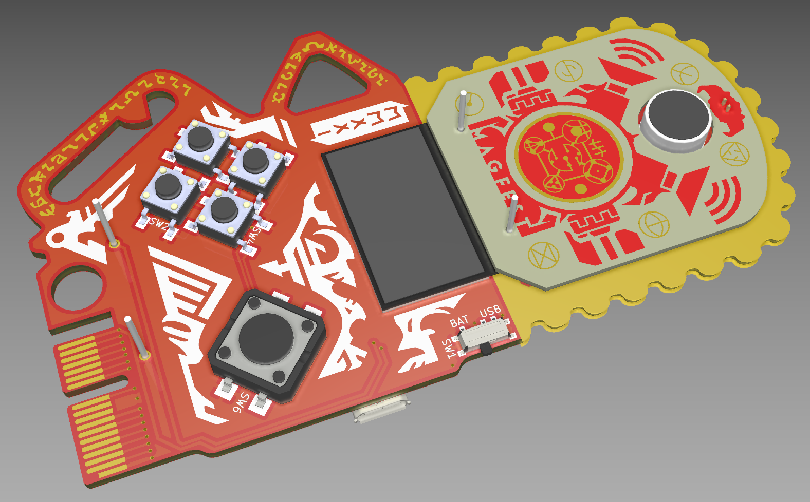
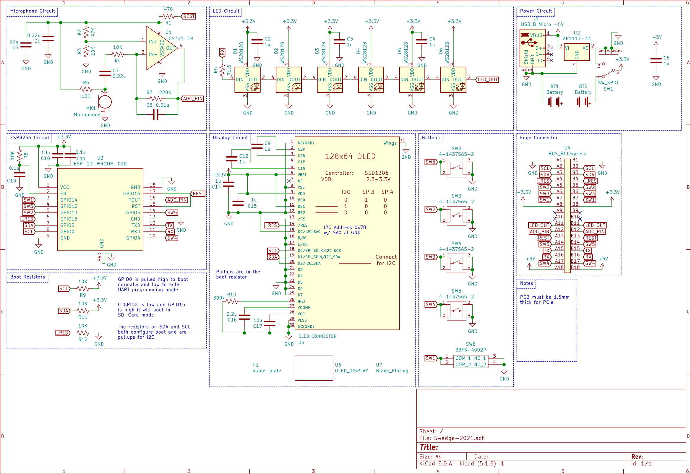

# Super Magfest 2022 Swadge Hardware

## Welcome

This is the hardware repository for the Super Magfest 2022 Swadge.

The corresponding firmware repository for the Super Magfest 2022 Swadge [can be found here](https://github.com/AEFeinstein/Super-2021-Swadge-FW).

If you have any questions, feel free to create a Github ticket or email us at circuitboards@magfest.org.

## Render

## Schematic

## Directories

### `Swadge-2021`
This directory has the KiCad project for the main Swadge PCB.
### `Swadge-Parts`
This directory is a git submodule which has all the parts, footprints, and 3D models used in this project.
### `art`
This directory has the SVGs used to generate the KiCad files. The SVGs are drawn in [Inkscape](https://inkscape.org/) and exported with [Svg2Shenzhen](https://github.com/badgeek/svg2shenzhen)
### `blade-plate-med-no-teeth`
This directory has the KiCad project for the PCB diffuser for the Swadge.
### `blade-plate`
This directory has the KiCad project for an experimental PCB diffuser for the Swadge. It was never manufacturered.
### `blade-plate-hole`
This directory has the KiCad project for an experimental PCB diffuser for the Swadge. It was never manufacturered.
### `blade-plate-no-teeth`
This directory has the KiCad project for an experimental PCB diffuser for the Swadge. It was never manufacturered.
### `blade-plate-small`
This directory has the KiCad project for an experimental PCB diffuser for the Swadge. It was never manufacturered.
### `blade-plate-small-no-teeth`
This directory has the KiCad project for an experimental PCB diffuser for the Swadge. It was never manufacturered.
### `Devkit-Addon`
This directory has the KiCad project for a PCB which would connect extra peripherals to a 2020 Barrel Swadge through a Swadge Programmer. It was never manufacturered.
